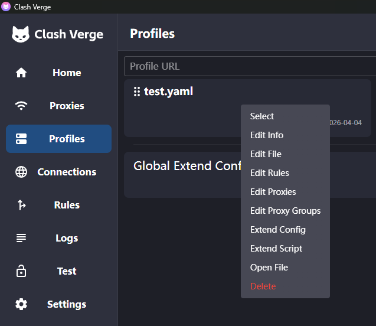
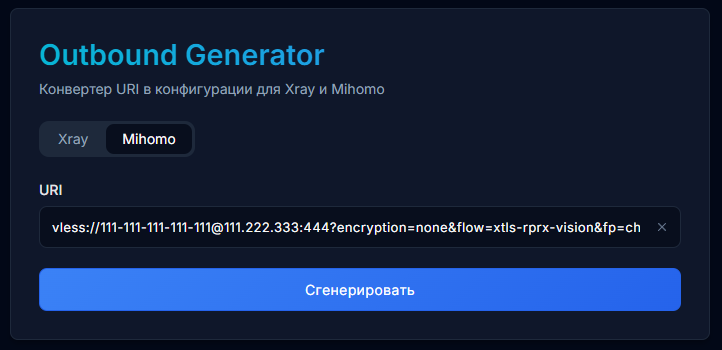
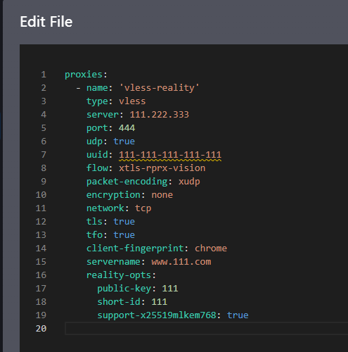
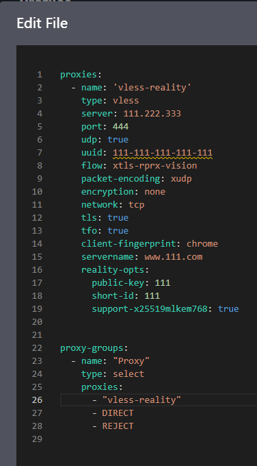

# Инструкция по подключению к VPN

Инструкция по подключению к VPN через приложение **Happ**.

> Для настройки вам понадобится только **ссылка на подписку**, которую я вам отправлю.

---

## Скачать Happ

### iPhone / iPad
- [App Store Global](https://apps.apple.com/us/app/happ-proxy-utility/id6504287215)
- [App Store Rus](https://apps.apple.com/ru/app/happ-proxy-utility-plus/id6746188973)
- [Testflight Global](https://testflight.apple.com/join/XMls6Ckd)
- [Testflight Rus](https://testflight.apple.com/join/1bKEcMub)

### Android
- [Google Play](https://play.google.com/store/apps/details?id=com.happproxy)
- [Download APK](https://github.com/Happ-proxy/happ-android/releases/latest/download/Happ.apk)

---

## Быстрый старт

### Телефон
1. Установите приложение **Happ**
2. Скопируйте ссылку подписки
3. Откройте **Happ**
4. Нажмите **плюс** в правом верхнем углу
5. Выберите **Добавить подписку**
6. Вставьте URL
7. Включите пункт **Разрешать небезопасные**
8. Сохраните подписку
9. Нажмите **Подключить**

### ПК
1. Откройте **Clash Verge**
2. Перейдите в **Profiles**
3. Нажмите **ПКМ** по нужному профилю
4. Выберите **Edit File**
5. Удалите старый текст из файла
6. Откройте ссылку подписки в браузере
7. Скопируйте строку `vless://...`
8. Откройте [Outbound Generator](https://zxc-rv.github.io/XKeen-UI/Outbound_Generator/)
9. Выберите **Mihomo** и нажмите **Сгенерировать**
10. Вставьте результат в файл
11. Добавьте блок `proxy-groups`
12. Сохраните файл

---

## Что понадобится

Для подключения нужны:

- приложение **Happ** на телефоне
- **Clash Verge** на ПК
- ссылка на подписку
- интернет для первой настройки

---

## Настройка на Android и iPhone

На телефонах рекомендуется использовать клиент **Happ**.

### Шаг 1. Установите Happ

Установите приложение **Happ** на телефон.

---

### Шаг 2. Скопируйте ссылку подписки

Я отправлю вам ссылку подписки.

Нужно именно:

1. Скопировать ссылку
2. Открыть приложение **Happ**
3. Нажать **плюс** в правом верхнем углу
4. Выбрать **Добавить подписку**
5. Вставить URL
6. Включить пункт **Разрешать небезопасные**
7. Сохранить подписку

> Важно: если при создании подписки появляется ошибка, включите пункт **Разрешать небезопасные** и попробуйте снова.

> Важно: ссылка может не открываться автоматически через приложение — это нормально. В таком случае её нужно просто вставить вручную в **Happ**.

---

### Шаг 3. Импортируйте профиль

После вставки ссылки:

1. Подтвердите добавление подписки
2. Дождитесь, пока профиль загрузится в приложение
3. Убедитесь, что профиль появился в списке

Если при добавлении возникает ошибка:

1. Вернитесь в окно добавления подписки
2. Проверьте, что URL вставлен полностью
3. Включите пункт **Разрешать небезопасные**
4. Сохраните подписку ещё раз

---

### Шаг 4. Подключитесь

1. Выберите импортированный профиль
2. Нажмите **Подключить**
3. Подтвердите системный запрос на создание VPN-подключения, если он появится

После этого VPN должен заработать.

---

## Обновление настроек на ПК через Clash Verge

Если на ПК уже установлен и настроен **Clash Verge**, то при изменении подключения можно обновить профиль вручную.

### Шаг 1. Откройте профиль

1. Откройте **Clash Verge**
2. Перейдите в раздел **Profiles**
3. Нажмите **ПКМ** по нужному профилю
4. Выберите **Edit File**



---

### Шаг 2. Удалите старый конфиг

Полностью удалите весь текст из файла профиля.

---

### Шаг 3. Получите строку VLESS

1. Откройте в браузере ссылку с подпиской
2. Внизу страницы скопируйте строку вида `vless://...`

---

### Шаг 4. Сгенерируйте конфиг Mihomo

1. Откройте сайт [Outbound Generator](https://zxc-rv.github.io/XKeen-UI/Outbound_Generator/)
2. Выберите **Mihomo**
3. Вставьте строку `vless://...`
4. Нажмите **Сгенерировать**



---

### Шаг 5. Вставьте сгенерированный конфиг

Скопируйте результат и вставьте его в файл профиля Clash Verge.

Должно получиться примерно так:



---

### Шаг 6. Добавьте proxy-groups

Ниже вставьте этот блок:

```yaml
proxy-groups:
  - name: "Proxy"
    type: select
    proxies:
      - "vless-reality"
      - DIRECT
      - REJECT
```

После этого файл должен выглядеть примерно так:



---

### Шаг 7. Сохраните файл

Сохраните изменения и пользуйтесь обновлённым подключением.

---

## Обновление подписки

Если настройки изменились или были добавлены новые сервера:

1. Откройте **Happ**
2. Найдите вашу подписку
3. Обновите её внутри приложения

После обновления подтянутся актуальные настройки.

---

## Если ссылка не импортируется

Проверьте:

- ссылка скопирована полностью
- в ссылке нет лишних пробелов
- интернет работает
- приложение **Happ** обновлено
- при добавлении включён пункт **Разрешать небезопасные**

Попробуйте ещё раз:
1. заново скопировать ссылку
2. заново вставить её в **Happ**
3. включить **Разрешать небезопасные**
4. перезапустить приложение

---

## Если VPN не подключается

Проверьте:

- профиль точно добавлен в приложение
- вы выбрали нужный профиль
- на телефоне есть интернет
- вы подтвердили системный запрос VPN

Попробуйте:
1. выключить и включить VPN ещё раз
2. обновить подписку
3. перезапустить приложение
4. перезагрузить телефон

---

## Если подключилось, но сайты не открываются

Попробуйте:

1. переподключиться
2. обновить подписку
3. перезапустить приложение
4. переключиться между Wi-Fi и мобильным интернетом
5. перезагрузить телефон

---

## Частые вопросы

### Почему ссылка не открывается сразу в приложении?
Такое бывает. Это не ошибка. Просто скопируйте ссылку и вставьте её вручную в **Happ**.

### Нужно ли сканировать QR-код?
Нет. Для настройки достаточно только ссылки подписки.

### Нужно ли выбирать другой клиент?
Нет. На телефонах рекомендуется использовать **Happ**.

### Что делать, если при создании подписки появляется ошибка?
При добавлении подписки включите пункт **Разрешать небезопасные**, а затем сохраните её ещё раз.

### Как обновить настройки на ПК?
Откройте профиль в **Clash Verge**, удалите старый текст, сгенерируйте новый конфиг через **Outbound Generator** в режиме **Mihomo**, вставьте его в файл и добавьте блок `proxy-groups`.

---

## Если нужна помощь

Если что-то не получилось, пришлите скриншот ошибки и напишите, на каком этапе возникла проблема.
